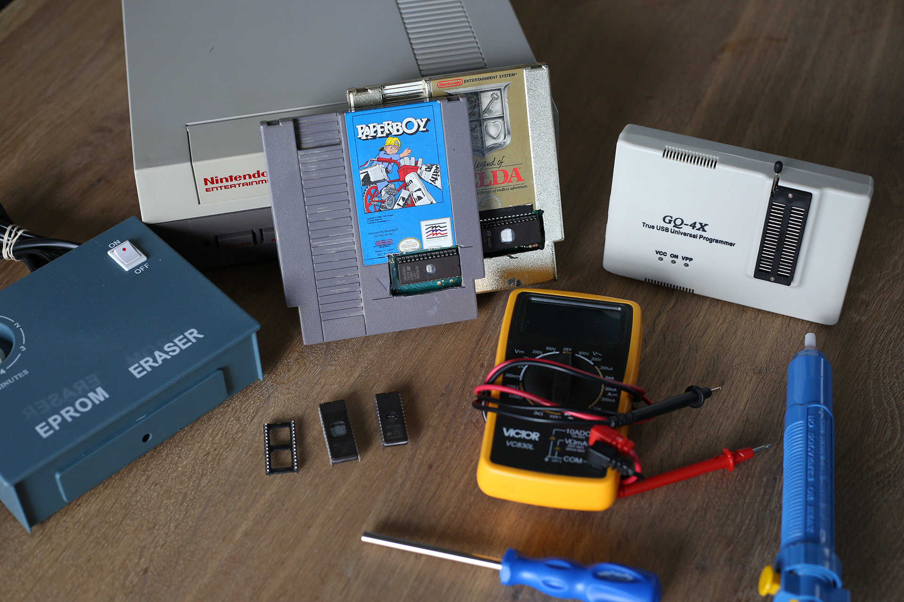

# Hacking a NES Classic

Exactly how difficult it is to take a NES cartridge, modify the 6502 assembly, and play the game on original hardware? Let's find out.

As an aside, I just love these projects. They're a great way to learn about hardware and software and spend time with friends.



The meanest trick of the late 80s and early 90s was unbeatable NES games marketed to children. (I'm looking at you Ninja Turtles by Ultra games).


Over a weekend, I got some close friends together from diverse backgrounds to attempt to make a hacked version of Paperboy and other classic NES games so I could finally lay to rest my childhood anger at some of these classic titles.

This is an attempt to demystify some of the process and allow you to create your own homebrews or modifications on original NES hardware.

--- 


There's something special about playing a game on an Atari, NES, C64, or SNES. Something about physical media and little black chips behind plastic shells feels magical.

### Shopping List

Starting out I purchased the following:

* EPROM Eraser
* Several copies of NES games (Paperboy, Zelda)
* a specialized screw driver to open NES games
* GQ-4X USB Universal Programmer
* EEPROM chips (You'll want to make sure you get these large enough to fit the original game, so don't buy 32kb ones for larger games). [Note on sizes below]
* Soldering iron and solder
* Solder sucker
* Multimeter (optional for paperboy, mandatory for games which require additional wiring, like Zelda).

### Desolder the PRG-ROM

The most difficult part of the project was removing the original ROM chip completely.  NES games often have two ROM's attached, a CHR-ROM and PRG-ROM.  Unless you're making modifications to the sprites themselves, you'll only need the PRG-ROM (essentially the .data section of x86 binaries).


For the best results we clamped the board to the table and heated the top of the board with the soldering iron while using the plunger on the other side of the board when the solder was molten.

### Install the riser

Once you've got the ROM removed, I soldered on a riser that would allow me to swap out the new chip if it didn't work without needing to resolder.


This is where we ran into the first problem.

### I bought the wrong chip sizes

I had incorrectly assumed that chips with 256kB in the name meant they had 256 kilobytes of data, but I was wrong, after some digging: EPROM chips sizes (denoted by the 256B) are actually named in kilobits, not kilobytes.  Zelda which needs 128kb chips require a 1 megaBIT (1024) EPROM chip.  Paperboy, however only needs 32kb so it would fit on our original the M27C256B.

The first letter of an EPROM chip (in this case, “M”) is the manufacturer, so when searching, you can omit the letter at the beginning.  “27C” is the description of the series of the chip.  “256B” is the size specified in kilobits (divide by 8 to get the kb equivalent of space).  The numbers after the ```-``` can usually be ignored and only pertain to the access speed of the chip and temperature range.

### Socket in

With the socket in place, the new EPROM chip will be too high off the pcb to put the original Nintendo cartridge back together properly, so we had to measure and cut out a hole that would let us hot-swap out chips as needed.


### Dumping the ROM data

The process for dumping the ROM was simple.  I wired up our USB Universal Programmer to the computer, installed the software, inserted the chip and dumped it in a couple minutes.

The ROM files you can download on the internet (if you own the original games) are really just exactly the same data you get from dumping the original PRG-ROM chip.  I created the NES header which was missing and bam, the game runs in an emulator!

### Hacking Paperboy's .code


In Paperboy you only start with 10 papers to throw to your customers, I decided to make that infinite, making an impossible game, only slightly less impossible.

Using FCEUX's emulator and debugger I searched for the value of '10' in the game's memory and threw a couple papers to watch it go down.  I found the memory address for "current paper count" at 0x00B1.

Now, editing the memory won't do us any good and won't be persistent when we burn it back to the EEPROM.  With the hex editor open add a write breakpoint to find the instructions that write to 0x00B1.


Here's the instruction that decrements a value in memory. [Here's a handy guide for the 6502 instruction set.](https://www.masswerk.at/6502/6502_instruction_set.html)


We can search for the byte pattern (in this case it's `C6 B1 20 EA 84 7F`) in our dumped ROM on disk.


Checking the 6502 instruction manual shows us that if we don't want that instruction to be executed (no operation), we can change it's bytes to 0xEA 0xEA (since it's two bytes, we need two nops).


Save the modified ROM file.

Burn the modified ROM to the EEPROM with the GQ-4X, insert the chip and enjoy your custom version of Paperboy on original hardware.

___